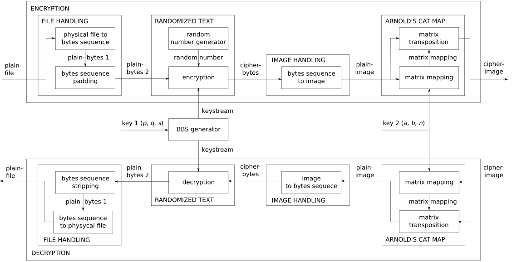
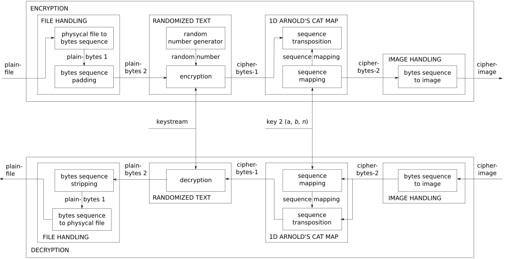

# ftie-cp

## Compile Instruction
``g++ -o bin/ftie-cli -std=c++17 ftie/*.h ftie/*.cpp main.cpp `libpng-config --ldflags` ``

## Requirements
- `g++ (Ubuntu 8-20180424-0ubuntu1~16.04.1) 8.0.1 20180424 (experimental) [trunk revision 259590]`
- `png++-0.2.9`

## System Block Diagram

## Deprecated System Block Diagram [[1]](https://www.researchgate.net/publication/320087595_File_To_Image_Encryption_FTIE_Menggunakan_Algoritma_Randomized_Text_Dan_Arnold_Cat_Map_ACM_Untuk_Keamanan_Transmisi_Data_Digital)

