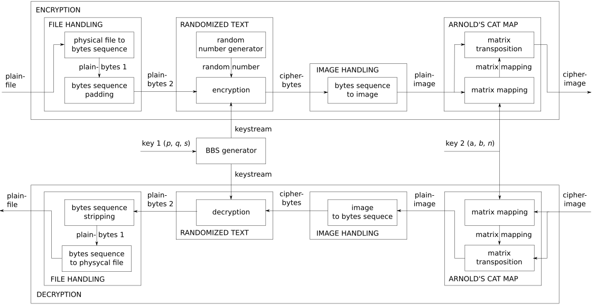
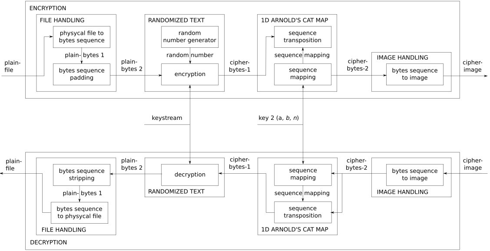

# ftie-cp

## Compile Instruction
```
g++ -o bin/ftie-cli -std=c++17 ftie/*.h ftie/*.cpp main.cpp `libpng-config --ldflags` -lgmpxx -lgmp
```

On macOS with Homebrew, Clang doesn't search `/opt/homebrew` by default and also errors on the `ftie/*.h`
glob when treated as separate translation units, so use instead:
```
g++ -o bin/ftie-cli -std=c++17 -I/opt/homebrew/include -L/opt/homebrew/lib ftie/*.cpp main.cpp `libpng-config --cflags --ldflags` -lgmpxx -lgmp
```

## Requirements
- `g++ (Ubuntu 8-20180424-0ubuntu1~16.04.1) 8.0.1 20180424 (experimental) [trunk revision 259590]`
- `png++-0.2.9`
- `gmp`/`gmpxx` (arbitrary-precision arithmetic for the BBS modulus) — `brew install gmp` on macOS, or the
  `libgmp-dev` package on Linux.

## Generating BBS primes
`P`/`Q` need to be ~1024-bit primes congruent to 3 mod 4 (so the BBS modulus `P*Q` is ~2048 bits). Generate
one at a time:
```
./bin/ftie-cli genprime 1024
```
Run it twice to get distinct `P` and `Q`, then pass the printed decimal values as CLI args to `encrypt`/`decrypt`.

## System Block Diagram


## Experiment Environment

```
aws ec2 create-security-group --group-name 'launch-wizard-1' --description 'launch-wizard-1 created 2026-08-30T08:25:41.152Z' --vpc-id 'vpc-00df7112eceed7a46' 
aws ec2 authorize-security-group-ingress --group-id 'sg-preview-1' --ip-permissions '{"IpProtocol":"tcp","FromPort":22,"ToPort":22,"IpRanges":[{"CidrIp":"0.0.0.0/0"}]}' 
aws ec2 run-instances --image-id 'ami-0f8a61b66d1accaee' --instance-type 'c7i.large' --ebs-optimized --block-device-mappings '{"DeviceName":"/dev/sda1","Ebs":{"Encrypted":false,"DeleteOnTermination":true,"Iops":3000,"SnapshotId":"snap-0cc002ff6c0b55ad2","VolumeSize":20,"VolumeType":"gp3","Throughput":125}}' --network-interfaces '{"AssociatePublicIpAddress":true,"DeviceIndex":0,"Groups":["sg-preview-1"]}' --metadata-options '{"HttpEndpoint":"enabled","HttpPutResponseHopLimit":2,"HttpTokens":"required"}' --private-dns-name-options '{"HostnameType":"ip-name","EnableResourceNameDnsARecord":true,"EnableResourceNameDnsAAAARecord":false}' --count '1' 
```

## Deprecated System Block Diagram [[1]](https://www.researchgate.net/publication/320087595_File_To_Image_Encryption_FTIE_Menggunakan_Algoritma_Randomized_Text_Dan_Arnold_Cat_Map_ACM_Untuk_Keamanan_Transmisi_Data_Digital)

